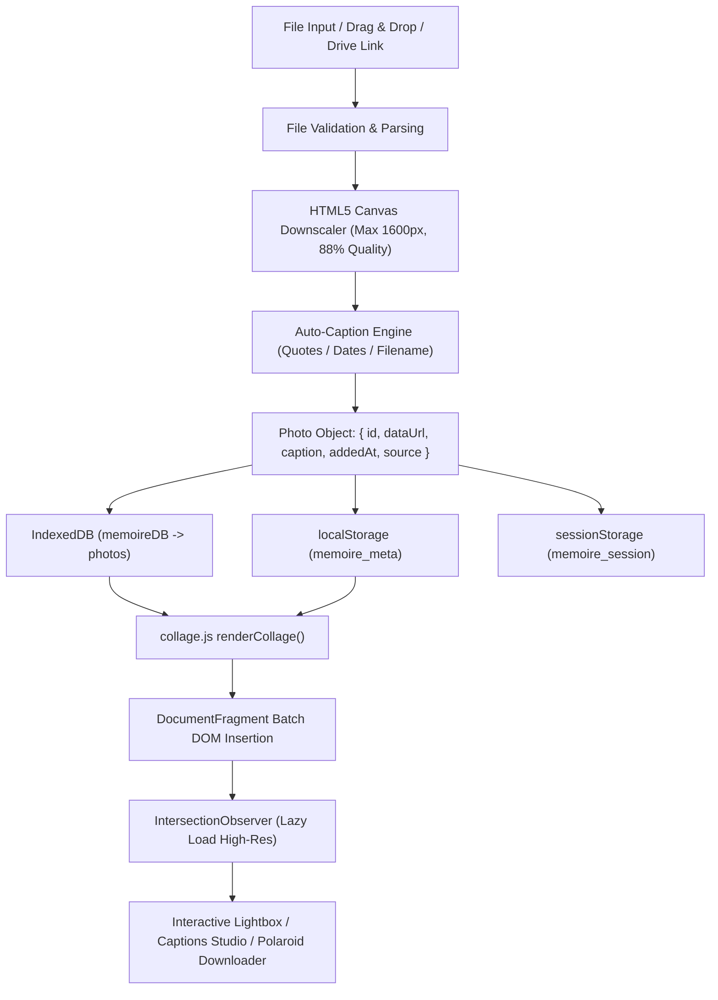

# 🧠 Mémoire — Complete Project Context & AI Agent Rules

> **System Notice for AI Agents**: This document provides the definitive architectural, operational, structural, and coding context for **Mémoire**. It contains all system constraints, state machines, storage contracts, DOM bindings, and code patterns needed to work autonomously and safely on this repository.

---

## 🧭 1. Repository Identity & Core Principles

- **Project Name**: Mémoire (Your Personal Memory Book)
- **Primary Purpose**: An aesthetic, client-side photo journal and Pinterest-inspired memory scrapbook.
- **Architectural Philosophy**:
  1. **Zero External Runtime Dependencies**: Built entirely with Vanilla JavaScript (ES6+), CSS3 (Tokens + Multi-Column Masonry), and Semantic HTML5. **DO NOT introduce npm modules, bundlers (Vite/Webpack), or external JavaScript frameworks (React/Vue/Angular)** unless explicitly mandated by the user.
  2. **100% Client-Side & Local-First**: All images, metadata, and user captions are stored locally in the browser (`IndexedDB` + `localStorage` + `sessionStorage`). No backend servers or tracking endpoints exist.
  3. **Performance First**: Auto-downscaling of large images via HTML5 Canvas (max 1600px, 88% JPEG), lazy loading via `IntersectionObserver`, and batch DOM insertion via `DocumentFragment`.
  4. **Aesthetic Excellence**: Glassmorphism, tailored HSL color tokens, curated Google Fonts (*Playfair Display*, *Dancing Script*, *Inter*), vintage polaroids, washi tape, and memory stickers.

---

## 🛠️ 2. Technology Stack & API Matrix

| Subsystem | Technology / Standard | Role & Implementation Details |
|---|---|---|
| **Markup** | HTML5 (Semantic & Accessible) | Modals (`role="dialog"`), accessible file inputs, PWA metadata, preconnect font tags |
| **Styling** | Vanilla CSS3 | Custom CSS variables / design tokens, CSS multi-column masonry, keyframes, safe-area insets |
| **Typography** | Google Fonts | *Playfair Display* (editorial serif), *Dancing Script* (scrapbook cursive), *Inter* (clean UI) |
| **Application State** | Vanilla JS (ES6+) | Global in-memory array `photos`, active index pointer, debounced persistence |
| **Local Database** | IndexedDB API (`memoireDB`) | High-capacity asynchronous object store for raw image data URLs |
| **Metadata Caching** | Web Storage API (`localStorage`) | Synchronous metadata cache (`memoire_meta`) and Google Drive API key persistence |
| **Session Cache** | Web Storage API (`sessionStorage`) | Ephemeral session state (`memoire_session`) for scroll position & order restoration |
| **Image Compression** | HTML5 Canvas 2D API | Client-side compression pipeline downscaling images to ≤1600px with 0.88 JPEG quality |
| **Polaroid Exporter** | HTML5 Canvas 2D API | Renders full printable polaroid images with vintage paper, cursive caption, and date metadata |
| **Cloud Import** | Google Drive REST API v3 | Public file downloading and recursive folder traversal via user API key |
| **Cloud Sync** | Google Identity Services (GIS) | OAuth 2.0 token flow to backup session to private `appDataFolder` (`memoire-session.json`) |
| **PWA** | Web App Manifest (`manifest.json`) | Standalone display mode, dark theme colors (`#0e0c15`), and notched safe-area handling |

---

## 📂 3. Directory & File Manifest

```text
Memoire/
├── index.html          # Semantic HTML5 DOM entry point, modals, templates & accessible controls
├── style.css           # Design tokens, themes, layouts, animations, responsive rules
├── app.js              # State controller, file ingestion, storage sync, Drive integration, Exporter
├── collage.js          # Layout engine (Masonry Waterfall), polaroid & sticker generators
├── drive-sync.js       # Google Identity Services (GIS) & appDataFolder cloud backup module
├── manifest.json       # PWA manifest, standalone display configurations & theme metadata
├── PROJECT_CONTEXT.md  # Comprehensive project context and AI agent rules (this document)
├── PROJECT_LOG.md      # Historical technical changelog & development milestones
└── README.md           # User-facing repository showcase and quickstart guide
```

### Module Responsibilities Breakdown

#### 1. [`index.html`](file:///e:/Projects/Memoire/index.html)
- **Header**: `#btnClearAll`, `#btnShuffle`, `#btnDriveImport`, `#uploadLabel` (`#fileInput`).
- **Drop Overlay**: `#dropOverlay` (fullscreen drag-and-drop feedback).
- **Empty State**: `#emptyState` with animated polaroid stack illustration (`.polaroid-stack`).
- **Stats Bar**: `#statsBar` showing `#photoCount` and `#btnViewCaptions`.
- **Collage Grid**: `#collageWrapper` containing `#collageGrid.collage-grid.masonry`.
- **Modals**:
  - `#driveModal`: Google Drive URL parser and API key configuration drawer.
  - `#captionsModal`: All captions studio with live search (`#captionsSearchInput`) and `#btnAutoCaptionAll`.
  - `#lightbox`: Full-screen polaroid viewer with `#lightboxImg`, `#lightboxCaption`, `#lightboxSuggestBtn` (`✨`), `#lightboxDate`, and `#lightboxDownloadBtn`.
- **Toasts**: `#toastContainer` for non-blocking feedback toasts.

#### 2. [`style.css`](file:///e:/Projects/Memoire/style.css)
- **Design Tokens**:
  - Backgrounds: `--bg-primary: #0e0c15;`, `--bg-secondary: #15121f;`, `--bg-card: #1a1628;`, `--bg-card-hover: #211c35;`
  - Accents: `--accent-primary: #c084fc;`, `--accent-secondary: #f0abfc;`, `--accent-gold: #fbbf24;`, `--accent-rose: #fb7185;`
  - Text: `--text-primary: #f1f0f5;`, `--text-secondary: #a09ab8;`, `--text-muted: #5e5878;`
  - Typography: `--font-display: 'Playfair Display'`, `--font-script: 'Dancing Script'`, `--font-body: 'Inter'`
  - Transitions: `--transition: 0.3s cubic-bezier(0.4, 0, 0.2, 1);`
- **Masonry Columns**:
  - `>1400px`: 6 columns | `1150px–1400px`: 5 cols | `850px–1150px`: 4 cols | `550px–850px`: 3 cols | `360px–550px`: 2 cols | `<360px`: 1 col.
- **Polaroid Styling**:
  - `.photo-card.polaroid-style`: `padding: 4px 4px 28px; background: linear-gradient(180deg, #fdfcf9 0%, #f6f3eb 100%);`
  - `.polaroid-footer`: `height: 28px;` containing `.polaroid-label` (cursive caption) and `.polaroid-meta` (date & index).
  - `.polaroid-tape`: Translucent washi tape accent (`42px × 12px`, `top: -4px; rotate(-1.5deg)`).

#### 3. [`collage.js`](file:///e:/Projects/Memoire/collage.js)
- **`seededRandom(photoId)`**: Deterministic 32-bit FNV-1a hash generator ensuring stable random styling per photo ID.
- **`getCardVariant(index, photoId)`**: Distributes card variants:
  - `isPolaroid`: `rng < 0.15` (~15% polaroids, serving as rare visual accents).
  - `hasSticker`: `index % 5 === 3` (every 5th card receives animated stickers `🌸`, `💫`, `🌟`, `❤️`, etc.).
  - `hasTape`: `isPolaroid && (rng > 0.08)` (decorative washi tape).
  - `tilt`: `TILTS[index % TILTS.length]` (subtle micro-tilt).
- **`buildPhotoCard(photo, index)`**: Creates card DOM element, sets up lazy loading observer, caption bar, hover overlay with actions (`✏ Caption`, `📥 Download`, `🗑 Delete`), and polaroid chin footer.
- **`renderCollage(photos, container)`**: Cleans previous `IntersectionObserver` instances and writes all cards using a single `DocumentFragment` insertion.

#### 4. [`app.js`](file:///e:/Projects/Memoire/app.js)
- **State**: `photos: Array<{ id, dataUrl, caption, addedAt, source? }>`, `currentIndex: Number`, `currentLayout: 'masonry'`.
- **Database CRUD**: `openIDB()`, `idbPut()`, `idbDelete()`, `idbGetAll()`, `idbClear()`.
- **Persistence Pipeline**: `saveToStorage()` debounces writes (250ms), saves full data URLs to IndexedDB, saves metadata snapshot to `localStorage` (`memoire_meta`), and updates `sessionStorage` (`memoire_session`).
- **Image Downscaling**: `compressImage(file)` canvas pipeline constraining longest dimension to ≤1600px at 88% JPEG quality.
- **Auto-Caption Engine**:
  - `MEMORY_QUOTES` (35+ curated poetic quotes).
  - `ATMOSPHERIC_DESCRIPTIONS` (10 scene descriptors).
  - `generateAutoCaption(fileOrName, timestamp)`: Evaluates clean filenames (`formatCleanFilename`), dates, and quotes.
  - `autoCaptionEmptyMemories()`: Bulk generator for uncaptioned photos.
  - `suggestCaptionForActivePhoto()`: Lightbox single-click `✨` suggestion tool.
- **Polaroid Exporter**: `downloadPolaroidCard(photoIndex)` creates an offscreen canvas rendering vintage photo paper, border bevels, the photo, cursive title, and date stamp, downloading as high-res PNG.
- **Google Drive Batch Importer**: `handleDriveImport()` auto-detects folder vs file URLs, queries Drive v3 REST API, and downloads images via multi-endpoint fallbacks.

#### 5. [`drive-sync.js`](file:///e:/Projects/Memoire/drive-sync.js)
- **Module `DriveSync`**: Manages OAuth 2.0 GIS token lifecycle, detects or creates `memoire-session.json` in `appDataFolder`, and provides debounced auto-syncing (3-second debounce).

---

## 🔄 4. Data Flow & Lifecycle Contracts



### Data Structures

```typescript
interface PhotoMemory {
  id: string;        // e.g. "photo_1723640000000_k9x2a" or "drive_1XYZ_1723640000000"
  dataUrl: string;   // Base64 image data URL (JPEG/PNG)
  caption: string;   // User caption or auto-generated quote
  addedAt: number;   // Timestamp (Date.now())
  source?: string;   // "local" | "google_drive"
}

interface SessionState {
  layout: "masonry";
  scrollY: number;
  photoIds: string[];
  lastUpdated: number;
}
```

---

## 🎨 5. Design Tokens & UI Guidelines

### Color Palette
- Background: `#0e0c15` (Deep space obsidian)
- Secondary Background: `#15121f` (Dark purple tinted night)
- Card Surface: `#1a1628` (Glassmorphic card container)
- Primary Accent: `#c084fc` (Ethereal lilac)
- Secondary Accent: `#f0abfc` (Blush pink)
- Gold Accent: `#fbbf24` (Vintage warm amber)
- Rose Accent: `#fb7185` (Coral danger/delete)
- Text Primary: `#f1f0f5` (Crisp off-white)
- Text Secondary: `#a09ab8` (Muted violet-grey)

### Typography Rules
- **Display Headings**: `'Playfair Display', Georgia, serif` (Editorial, elegant).
- **Polaroids & Handwritten Notes**: `'Dancing Script', cursive` (Authentic scrapbook feel).
- **Interface & Metadata**: `'Inter', system-ui, sans-serif` (Clean, highly legible).

### Touch & Mobile UX Rules
- All interactive controls (`button`, `input`, `.photo-card`) must include `touch-action: manipulation` and `-webkit-tap-highlight-color: transparent` to prevent 300ms mobile tap delays and ugly grey flash artifacts.
- Modals and fixed headers must respect `--safe-bottom: env(safe-area-inset-bottom, 0px)` and safe-area margins for notched iOS and Android devices.

---

## 📋 6. Strict Rules & Conventions for AI Agents

When contributing to or refactoring this codebase, strictly follow these rules:

1. **No External Dependencies**: Do NOT run `npm install`, add `package.json`, or link remote JS libraries/frameworks unless explicitly requested.
2. **Storage Atomicity**: When mutating `photos` (adding, editing caption, deleting, reordering):
   - Always update in-memory `photos` array.
   - Always call `saveToStorage()` to synchronize IndexedDB and localStorage.
3. **DOM Performance**:
   - Never insert cards one-by-one into the DOM. Always accumulate into `DocumentFragment` and perform a single `container.appendChild(frag)`.
   - When calling `renderCollage()`, always disconnect any active `IntersectionObserver` before clearing container HTML to prevent memory leaks.
4. **Polaroid Aesthetics**:
   - Maintain the ~15% polaroid distribution (`rng < 0.15`) as subtle visual highlights in the masonry grid.
   - Maintain the >85% image portion in polaroids (slim 4px borders, compact 28px chin).
   - Ensure the Polaroid PNG exporter (`downloadPolaroidCard`) accurately reflects changes to polaroid styling or typography.
5. **Auto-Caption Engine**:
   - Newly ingested photos must always receive an initial caption via `generateAutoCaption()` so polaroids and cards are never blank.
   - Keep the suggestion button (`#lightboxSuggestBtn`) minimal (icon `✨` without redundant words).

---

## 📜 7. Chronological Development Milestones

- **Phase 1**: Initial Genesis — Semantic HTML5, dark glassmorphism design tokens, CSS masonry layout.
- **Phase 2**: Offline Database — IndexedDB (`memoireDB`) integration with localStorage metadata cache.
- **Phase 3**: Lightbox Studio — Full-screen viewer, keyboard navigation (`←`/`→`/`Esc`), mobile touch swipe gestures.
- **Phase 4**: Captions Studio — "All Captions" modal studio with real-time caption search and photo jump links.
- **Phase 5**: Google Drive Integration — Public folder/file scanner (REST API v3) & GIS OAuth AppData sync.
- **Phase 6**: Performance Optimizations — Canvas auto-downscaler, lazy loading observer, idle background particles.
- **Phase 7**: Polaroid Framework — Script cursive captions, date stamps, washi tape, and memory badges.
- **Phase 8**: Auto-Caption Engine — Automated poetic quotes, timeline titles, and interactive `✨` suggestion tool.
- **Phase 9**: Polaroid Proportion Optimization — Handheld scale (160px–240px heights) and high grid density.
- **Phase 10**: High-Resolution Polaroid Exporter — Client-side HTML5 Canvas PNG polaroid downloader.
- **Phase 11**: Masonry Unification & Image Maximization — Dedicated Masonry layout, ~15% accent polaroids, and >85% photo coverage.
