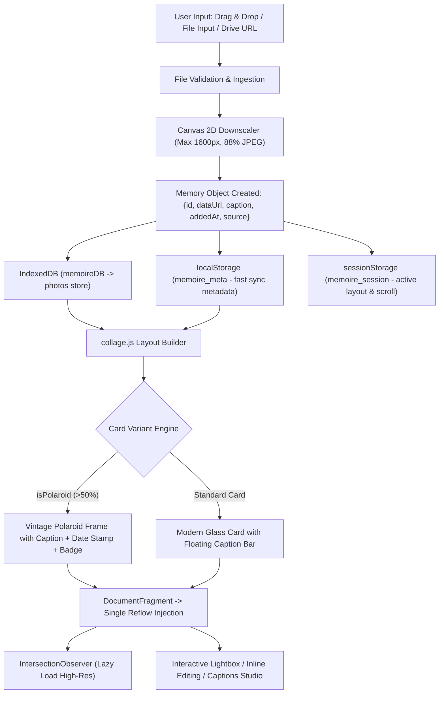

# 📜 Mémoire — Project Log & Architecture Reference

> **Note for AI Agents & Developers**: This document is the single source of truth for the technical architecture, data flows, layout algorithms, storage lifecycle, and chronological development history of **Mémoire**. Refer to this guide before making modifications or extending functionality.

---

## 🧭 1. Executive Summary & Philosophy

- **Project Name**: Mémoire (Your Personal Memory Book)
- **Concept**: A Pinterest-inspired, client-side aesthetic memory journal and scrapbook collage studio.
- **Core Philosophy**:
  1. **Zero External Runtime Dependencies**: Pure Vanilla ES6+, CSS3, and Semantic HTML5. No bundlers, Node runtime, or external JS frameworks required.
  2. **100% Local-First & Privacy-Preserving**: All uploaded photos and captions reside strictly inside browser-managed storage (`IndexedDB` + `Web Storage`).
  3. **High-Performance Rendering**: Canvas client-side compression, `IntersectionObserver` lazy loading, batch `DocumentFragment` DOM insertion, and idle-scheduled animations.
  4. **Aesthetic Excellence**: Dark glassmorphic UI, curated Google Fonts (*Playfair Display*, *Dancing Script*, *Inter*), vintage polaroids, organic tilts, and washi-tape scrapbook styling.

---

## 🏗️ 2. Architectural Blueprint & File Map

```text
Memoire/
├── index.html          # Semantic HTML5 DOM entry point, accessible modals & dialogs
├── style.css           # Design tokens, themes, layouts, animations, responsive rules
├── app.js              # State controller, file ingestion, storage sync, Drive integration
├── collage.js          # Layout engine (Masonry, Grid, Scattered), polaroid & sticker generators
├── drive-sync.js       # Google Identity Services (GIS) & appDataFolder cloud backup module
├── manifest.json       # PWA manifest, standalone display configurations & theme metadata
├── PROJECT_LOG.md      # Comprehensive project log, technical flow & reference guide (this file)
└── README.md           # User-facing showcase and repository overview
```

### Component Responsibilities

| File | Core Responsibilities |
|---|---|
| [`index.html`](file:///e:/Projects/Memoire/index.html) | Header controls, Ambient background particle canvas container, Drop zone overlay, Empty state illustration, Google Drive import modal, Stats bar & layout toggle buttons, Main collage viewport, Captions Studio modal, Polaroid Lightbox viewer, Toast container. |
| [`style.css`](file:///e:/Projects/Memoire/style.css) | Custom CSS design tokens (`--bg-primary`, `--accent-primary`, `--border`, `--shadow-glow`, etc.), Glassmorphic header & modals, CSS multi-column masonry, Auto-fill CSS grids, Authentic polaroid paper styling, Washi tape accents, Micro-animations (`cardIn`, `lightboxIn`, `toastIn`, `floatDot`). |
| [`app.js`](file:///e:/Projects/Memoire/app.js) | Global state `{ photos: Array, currentIndex: Number, currentLayout: String }`, `IndexedDB` CRUD (`openIDB`, `idbPut`, `idbDelete`, `idbGetAll`, `idbClear`), Debounced storage persistence, Canvas image compression (max 1600px, 88% JPEG), Drag & drop event pipeline, Lightbox navigation & inline caption sync, Google Drive REST v3 batch importer, Captions search engine. |
| [`collage.js`](file:///e:/Projects/Memoire/collage.js) | `renderCollage()` DOM builder using `DocumentFragment`, `seededRandom()` deterministic hash generator, Card variant distributor (>50% polaroids with metadata), `IntersectionObserver` lazy loader, Fisher-Yates array shuffle. |
| [`drive-sync.js`](file:///e:/Projects/Memoire/drive-sync.js) | Optional OAuth 2.0 GIS integration to backup and sync `memoire-session.json` directly to the user's hidden Google Drive `appDataFolder`. |
| [`manifest.json`](file:///e:/Projects/Memoire/manifest.json) | Web App Manifest for mobile installation, notched screen safe-area handling, and standalone display. |

---

## 🔄 3. Data Flow & Lifecycle



### Storage Schema & Keys
- **`IDB_NAME = 'memoireDB'` / `IDB_STORE = 'photos'` (v1)**:
  - Stored object: `{ id: string, dataUrl: string, caption: string, addedAt: number, source?: string }`
  - High-capacity offline persistence for raw image data.
- **`LS_META_KEY = 'memoire_meta'` (localStorage)**:
  - Stored object: `Array<{ id, caption, addedAt, source }>`
  - Instant synchronous access to memory count and captions on boot.
- **`LS_SESSION_KEY = 'memoire_session'` (sessionStorage)**:
  - Stored object: `{ layout: string, scrollY: number, photoIds: string[], lastUpdated: number }`
  - Instant layout state and viewport scroll restoration across tab reloads.
- **`LS_API_KEY = 'memoire_drive_api_key'` (localStorage)**:
  - Persists user-supplied Google Cloud Drive API key for folder traversal.

---

## 🎨 4. Layout Engine & Polaroid Architecture

### Card Variant Distribution Algorithm
To create a rich, tactile memory-book aesthetic, card variants are computed deterministically per photo ID via a seeded FNV-1a 32-bit hash:

```javascript
function seededRandom(str) {
  let h = 2166136261;
  for (let i = 0; i < str.length; i++) {
    h ^= str.charCodeAt(i);
    h = (h * 16777619) >>> 0;
  }
  return (h >>> 0) / 4294967296;
}
```

- **Polaroid Ratio**: **65%** in standard Masonry and Grid layouts (`rng < 0.65`), and **100%** in Scattered Scrapbook layout.
- **Polaroid Data Framing**:
  - **Upper Photo Area**: Framed with 10–12px white/cream borders with subtle photographic bevel.
  - **Lower Polaroid Chin**: Generous 52–60px footer featuring:
    1. **Primary Caption**: Handwritten script font (*Dancing Script* / cursive), synced with Lightbox edits.
    2. **Metadata Stamp**: Formatted calendar date (e.g., `AUG 14, 2026`) and memory sequence tag (`#01`).
    3. **Scrapbook Washi Tape**: Organic semi-transparent craft tape applied to card corners.
- **Sticker Accents**: Every 5th card receives an animated memory sticker (`🌸`, `💫`, `🌟`, `❤️`, `🎉`, `🌈`, `✨`, `🦋`).
- **Scattered Tilts**: Dynamic micro-rotations in `[-3°, -2°, -1.5°, -1°, 0°, +1°, +1.5°, +2°, +3°]` for organic scrapbook collage feel.

---

## ☁️ 5. Google Drive Integration Specification

Mémoire features a dual-mode Google Drive system:

1. **Public File & Folder Importer (REST API v3)**:
   - Auto-detects single file links (`/file/d/{id}`, `/open?id={id}`, `lh3.googleusercontent.com/d/{id}`) and folder links (`/folders/{id}`).
   - Recursively queries the folder image manifest with `mimeType` filtering (`image/jpeg`, `png`, `webp`, `heic`, etc.).
   - Utilizes multi-endpoint fallback URLs to load and downsample Google Drive images directly to client-side data URLs.
2. **Private AppData Sync (Google Identity Services)**:
   - Uses OAuth 2.0 GIS token flow to store `memoire-session.json` inside the user's private Google Drive `appDataFolder`.
   - Debounced automatic synchronization (3-second delay after caption or photo modifications).

---

## 📜 6. Chronological Project Changelog

### Phase 1 — Initial Genesis & Core Engine
- Established zero-dependency Vanilla ES6+ and CSS3 foundational architecture.
- Implemented responsive CSS Multi-Column Masonry and CSS Auto-Fill Grid layouts.
- Built drag-and-drop file ingestion and HTML5 Canvas downsampling engine.
- Designed dark aesthetic design system with glassmorphism and modern design tokens.

### Phase 2 — Persistence & Offline Database
- Transitioned from storage-limited localStorage to `IndexedDB` (`memoireDB`).
- Introduced dual-tier storage strategy (IDB for images + localStorage for metadata).
- Implemented `sessionStorage` state restoration (active layout, scroll position).

### Phase 3 — Lightbox Studio & Touch Navigation
- Built full-screen polaroid-style Lightbox viewer.
- Added bidirectional navigation (`←`/`→` arrow keys, navigation buttons).
- Implemented mobile `TouchEvents` swipe gesture detection for smooth swiping on touchscreens.
- Added live inline caption editing inside the lightbox with keyboard shortcut (`Enter` to save, `Esc` to exit).

### Phase 4 — Captions Studio & Live Search
- Built the "All Captions" modal studio (`#captionsModal`).
- Implemented real-time caption search matching with memory indexing and live stats.
- Added direct jump-to-photo links from search results into the lightbox.

### Phase 5 — Google Drive Batch Importer
- Built Google Drive modal with auto-detection of file vs folder links.
- Integrated Drive REST API v3 folder scanning with custom API key management.
- Implemented multi-URL image download fallback pipeline (`lh3.googleusercontent.com`, `drive.google.com/thumbnail`, `drive.google.com/uc`).

### Phase 6 — Performance Optimization & Polish
- Implemented `IntersectionObserver` lazy loading with 1px placeholder and 200px pre-fetch threshold.
- Optimized DOM mutations using `DocumentFragment` batch insertion to eliminate layout thrashing.
- Scheduled ambient floating particles via `requestIdleCallback`.
- Added PWA `manifest.json` with standalone display settings and mobile safe-area insets.

### Phase 7 — Polaroid Layout Upgrade (>50% with Metadata)
- **High-Ratio Polaroid Distribution**: Increased baseline polaroid probability from ~20% to **65%** in standard layouts and **100%** in Scattered Scrapbook layout, satisfying the >50% requirement.
- **Enriched Polaroid Metadata**: Upgraded the polaroid frame chin to render structured metadata:
  - Handwritten cursive caption (`.polaroid-label`).
  - Stamped date indicator and memory number badge (`.polaroid-meta` -> `.polaroid-date`, `.polaroid-badge`).
  - Washi tape scrapbook accents (`.polaroid-tape`).
- **Real-Time Synchronization**: Updated `saveLightboxCaption()` to seamlessly update both caption and metadata elements across the active card and lightbox.

### Phase 8 — Intelligent Auto-Caption Engine (Dates, Quotes & Descriptions)
- **Automatic Captioning on Ingestion**: Embedded intelligent auto-captioning into `processFiles()` and `importSingleFile()`. Uploaded photos without custom names are automatically assigned poetic quotes, date-based memory stamps (e.g. `Captured in Aug 2026`, `Moments from August '26`), or atmospheric descriptions (e.g. `Golden hour tranquility`, `Sunlit daydream ✨`).
- **Descriptive Filename Sanitizer**: Implemented `formatCleanFilename()` to convert human-named image files (`cozy_sunset_walk.jpg`) into formatted titles while filtering generic camera prefixes (`IMG_`, `PXL_`, `DSC_`).
- **Interactive Lightbox Suggestion Tool**: Added the `✨ Quote` button in the lightbox viewer for one-click cycling through evocative memory quotes and descriptions.
- **Bulk Studio Auto-Captioning**: Added `✨ Auto-Caption Empty` in the Captions Studio Modal to batch-generate evocative captions for all uncaptioned photos.

### Phase 9 — Polaroid Size Optimization & Compact Aesthetics
- **Compact Handheld Dimensions**: Scaled down polaroid max-heights from 380px–480px to **160px–240px** for authentic handheld snapshot proportions.
- **Tighter Framing & Chin**: Reduced polaroid frame padding from `10px 10px 50px` to `8px 8px 38px`, streamlining the chin height to 38px.
- **Increased Responsive Grid Density**: Updated masonry layout to 6 columns on desktop (with proportional 5/4/3/2 column breakpoints) and decreased grid item min-width from 220px to 175px (160px in scattered mode).
- **Refined Lightbox Scale**: Scaled lightbox polaroid frame and image constraints (`max-width: 560px`, `max-height: 60vh`) for balanced, elegant presentation.

### Phase 10 — High-Resolution Polaroid Exporter & UI Polish
- **Client-Side Polaroid Image Generator**: Implemented `downloadPolaroidCard()` using HTML5 Canvas to render authentic, high-resolution downloadable PNG polaroid photos complete with paper texture gradients, bevel borders, cursive handwritten captions, and date/index metadata stamps.
- **Download Action Buttons**: Integrated instant download buttons in both the Lightbox modal (`#lightboxDownloadBtn`) and each individual photo card's hover action overlay (`[data-action="download"]`).
- **Clean UI Polish**: Removed redundant textual labels (such as `"Quote"`) from the suggestion button, converting it into a sleek, minimal `✨` icon button for a distraction-free memory viewer.

### Phase 11 — Masonry Unification, Polaroid Reduction (>80%) & Image Maximization
- **Unified Masonry Waterfall**: Removed Grid and Scattered views to establish the Pinterest-style **Masonry Waterfall** as the single layout. Streamlined the stats bar by removing switcher buttons.
- **80%+ Reduction in Polaroid Frequency**: Reduced polaroid frequency down to **~15%** (`rng < 0.15`), making polaroids rare accent highlights while ~85% of cards display as full-bleed memories.
- **Maximized Photo Coverage**: Enlarged the photo portion within polaroid cards with ultra-slim 4px borders and a compact 28px chin, allocating >85% of the card area to the photo.

---

## 🛠️ 7. Agent Guidelines for Future Work

When extending or maintaining this codebase:
1. **Preserve Zero-Dependency Principle**: Do not introduce npm packages, bundlers, or remote framework scripts unless explicitly requested by the user.
2. **Keep Storage Atomic**: Always perform image operations in `IndexedDB` and metadata snapshots in `localStorage`/`sessionStorage` via `saveToStorage()`.
3. **Maintain Polaroid Fidelity**: Ensure any changes to card rendering retain the vintage paper chin, script typography, and structured metadata.
4. **Test Responsive Breakpoints**: Verify layout rendering across desktop (5 cols), laptop (4 cols), tablet (3 cols), mobile (2 cols), and ultra-compact screens (1 col).
